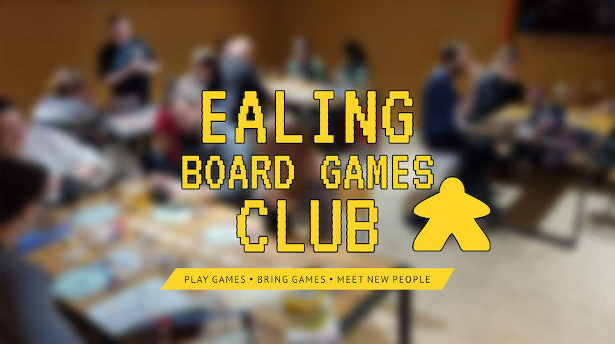

# Ealing Boardgames' Club

A modern, responsive website for the Ealing Boardgames' Club, a non-profit community organization based in West London. This React-based website serves as the digital hub for board game enthusiasts in the Ealing area.

**Live Site:** https://ealingboardgames.co.uk



## About

Ealing Boardgames' Club is a vibrant community bringing together board game enthusiasts in West London. Our website provides information about events, meetups, and ways to connect with fellow gamers in the area.

## Getting Started

### Prerequisites

- Node.js (version 14 or higher)
- npm or yarn package manager

### Installation

1. Clone the repository:
   ```bash
   git clone https://github.com/your-username/ealing-board-games-pages.git
   cd ealing-board-games-pages
   ```

2. Install dependencies:
   ```bash
   npm install
   ```

3. Start the development server:
   ```bash
   npm start
   ```

The application will open in your browser at `http://localhost:3000`.

## Project Structure

```
src/
├── components/
│   ├── ErrorBoundary.js
│   ├── footer/
│   ├── layout/
│   ├── leftSection/
│   └── rightSection/
├── pages/
│   └── HomePage.js
├── App.js
├── index.js
└── styles.css
```

## License

This project is open source and available under the [MIT License](LICENSE).

## Contact

For questions about the club or website, please visit our live site at https://ealingboardgames.co.uk